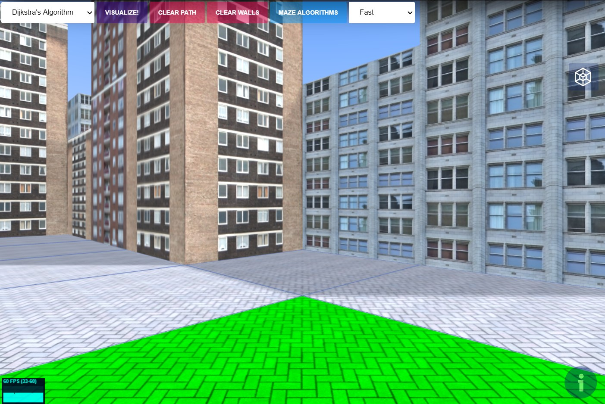

<h1 align="center">Pathfinding Visualizer ThreeJS</h1>
<h2 align="center">

[](https://github.com/vuejs/awesome-vue)

</h2>

*A Visualizer for pathfinding algorithms in 3D.*

## Live Demo
The live demo can be found [here]().


## Features
### Weighted and unweighted algorithms
* **Dijkstra’s algorithm** (weighted) <br>
The father of pathfinding algorithms, it creates a tree of shortest paths from the starting vertex, the source, to all other points in the graph. <b>Guarantees</b> the shortest path!

* **A\* Search algorithm** (weighted) <br>
One of the best and a popular technique used in path-finding and graph traversals with heuristic. <b>Guarantees</b> the shortest path!

* **Breadth-First Search** (unwighted) <br>
The algorithm starts at the tree root, and explores all of the neighbor nodes at the present depth prior to moving on to the nodes at the next depth level. <b>Guarantees</b> the shortest path!

* **Depth-First Search** (unwighted) <br>
The algorithm starts at the root node and explores as far as possible along each branch before backtracking. <b>Does not guarantee</b> the shortest path!

### Maze generation
Two methods to generate a maze:
* Recursive Division
* Random

### First-Person view
Roam around the world you create in First-Person view and watch the algorithm move under your feet!




### WebGL Library
Three.js

### Assets & Icons
Textures from [OpenGameArt.org](https://opengameart.org/)

Icons made by [Freepik](https://www.flaticon.com/authors/freepik) from [www.flaticon.com](https://www.flaticon.com/)

## Contributing
Contributions are welcome. Please read [CONTRIBUTING.md](./CONTRIBUTING.md) for more information.

## Project setup
```
npm install
npm run serve
```

## Future Scope
* Add touch controls for first-person view
* Add visited nodes counter and path length
* Add more algorithms to visualize


